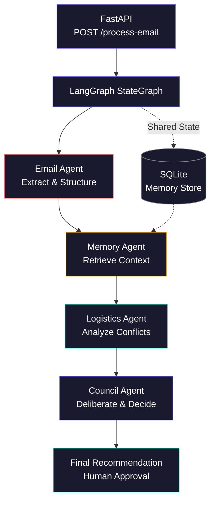

# CareFlow AI — Multi-Agent Caregiving Intelligence System

CareFlow AI is an end-to-end **multi-agent workflow** for **Caregiver-CEOs**: it ingests coordination emails (clinic, transport, family), enriches them with **SQLite-backed memory**, runs **logistics reasoning**, and produces a **deliberative council recommendation** with optional **human approval** and a full **audit trail**. A **React + Three.js** console visualizes agent progress, streaming updates, and outcomes.

---

## Overview

Inbound email flows through a **LangGraph** linear pipeline: **Email → Memory → Logistics → Council**. Each node is an async agent backed by **Groq** (`llama-3.3-70b-versatile`). State is merged after each step; failures short-circuit to `END`. Results persist in **SQLite** (`workflow_sessions`, `audit_log`, `patient_profiles`, `appointments`).

### Architecture



---

## Tech stack

| Layer | Technology |
|--------|------------|
| Runtime | Python 3.11 |
| API | FastAPI |
| Orchestration | LangGraph |
| LLM | Groq — `llama-3.3-70b-versatile` |
| Persistence | SQLite (aiosqlite) |
| Frontend | React 18, TypeScript, Vite |
| 3D | Three.js, React Three Fiber, Drei |
| Motion | Framer Motion |
| HTTP client | Axios |

---

## Getting started

### 1. Clone the repository

```bash
git clone <repository-url>
cd careflowAI
```

### 2. Backend

```bash
cd backend
python -m venv venv
source venv/bin/activate   # Windows: venv\Scripts\activate
pip install -r requirements.txt
cp .env.example .env
# Edit .env: set GROQ_API_KEY. For local SQLite, set DATABASE_URL=./careflow.db (defaults in code target Render; override for laptop).
```

### 3. Frontend

```bash
cd ../frontend
npm install
```

### 4. Run the backend

From `backend/` with the virtual environment activated:

```bash
uvicorn app.main:app --reload --port 8000
```

### 5. Run the frontend

From `frontend/`:

```bash
npm run dev
```

### 6. Open the app

[http://localhost:5173](http://localhost:5173) — the Vite dev server proxies `/api` to `http://localhost:8000`.

**Quick pipeline test (no UI):** from `backend/` after configuring `.env`:

```bash
python test_workflow.py
```

### Deploy backend (Render)

Use `backend/render.yaml` as a blueprint (set the service **root directory** to `backend` if the repo is monorepo). Configure `GROQ_API_KEY` in the Render dashboard. Persistent disk mounts at `/opt/render/project/src` so `careflow.db` survives redeploys.

---

## API reference

| Method | Path | Description |
|--------|------|-------------|
| `GET` | `/` | Root health (`status`, `app`). |
| `GET` | `/api/health` | Liveness for load balancers: `status`, `app`, `version`. |
| `GET` | `/api/demo` | Canonical assignment email plus scenario `context` (patient, doctor, caregiver). |
| `POST` | `/api/process-email` | JSON `{ "email": "..." }` — run full workflow; returns serialized workflow result. |
| `GET` | `/api/process-email/stream` | Query `email=` — SSE stream (`agent_started`, `agent_completed`, `workflow_completed`, `workflow_failed`, `error`). |
| `POST` | `/api/sessions/{session_id}/approve` | JSON `{ "action": "approve"|"reject"|"review", "notes": "" }`. |
| `GET` | `/api/sessions/{session_id}` | Session row + parsed `result_data` + `audit_log`. |
| `GET` | `/api/sessions/{session_id}/audit` | `{ session_id, audit_log }`. |

---

## Agents

| Agent | Role |
|-------|------|
| **Email** | Parses inbound messages; structured extraction (entities, intent, action items). |
| **Memory** | Loads `patient_profiles` and recent `appointments`; grounds the case in stored context. |
| **Logistics** | Scheduling and transport implications; risks and recommended actions. |
| **Council** | Synthesis: recommendation, reasoning, tradeoffs, priority actions, confidence — may set workflow to **awaiting approval**. |

---

## Assumptions

1. **Single primary patient** in demo seed data (“Father”) is sufficient to illustrate memory-augmented flows; production would index many patients and disambiguate by identifiers in the email.
2. **Groq** is available and `GROQ_API_KEY` is valid; without it, agents fail at LLM call time (no silent mock LLM in production paths).
3. **Email body is the unit of work** — attachments and HTML-heavy newsletters are not specialized; content is treated as plain text through the stack.
4. **Human approval** is modeled as session metadata updates (`approve` / `reject` / `review`); it does not automatically trigger external side effects (calendar APIs, SMS, etc.).
5. **SSE streaming** uses a query-string email payload; very long bodies should use `POST /api/process-email` instead (the frontend switches automatically above a length cap).
6. **SQLite file** path comes from settings (`DATABASE_URL`); concurrent write volume suitable for demo/single-node use, not high-tenancy cloud scale without migration.
7. **LangGraph state** uses TypedDict + reducers for `errors` and `audit_trail`; downstream code assumes merged lists are chronological enough for UI display.

---

## Bonus features implemented

- **Persistent memory** — patient profiles and appointment history in SQLite, queried by the Memory agent.
- **Human approval layer** — council can stop at `awaiting_approval`; REST endpoint records approve/reject/review with notes.
- **Audit log** — per-agent rows in DB and in streamed `audit_trail`; collapsible UI table with JSON export.
- **Streaming execution** — Server-Sent Events for per-agent progress without blocking on the full graph.
- **3D UI** — React Three Fiber orbital visualization of the four agents (desktop + mobile-friendly placement).

---

## Future improvements

- **Scale to 10+ agents** — subgraphs, parallel branches, and dynamic routing instead of a single linear chain.
- **Vector DB memory** — embeddings for past emails and clinical notes; hybrid retrieval with structured SQLite fields.
- **LangGraph checkpointing** — durable interrupts, resume-from-node, and time-travel debugging for long-running care plans.
- **Multi-user sessions** — authn/z, tenant isolation, and per-family data partitions.
- **Mobile app** — native or Capacitor shell with push notifications for approval tasks and transport alerts.

---

## License / attribution

Built for the **Maverick AI** assignment (2026). See repository root for license if provided.
