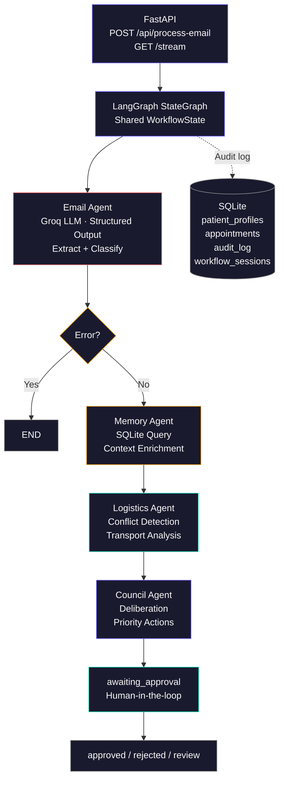

# CareFlow AI — Multi-Agent Caregiving Intelligence System

CareFlow AI is an end-to-end **multi-agent workflow** for **Caregiver-CEOs**: it ingests coordination emails (clinic, transport, family), enriches them with **SQLite-backed memory**, runs **logistics reasoning**, and produces a **deliberative council recommendation** with optional **human approval** and a full **audit trail**. A **React + Three.js** console visualizes agent progress, streaming updates, and outcomes.

---

## Overview

Inbound email flows through a **LangGraph** linear pipeline: **Email → Memory → Logistics → Council**. Each node is an async agent backed by **Groq** (`llama-3.3-70b-versatile` via `langchain-groq`). State is merged after each step; failures short-circuit to `END`. Results persist in **SQLite** (`workflow_sessions`, `audit_log`, `patient_profiles`, `appointments`).

### Architecture



---

## Repository layout

| Path | Role |
|------|------|
| `backend/` | FastAPI app (`app.main:app`), LangGraph workflow, SQLite store, `requirements.txt`, `Dockerfile`, `Procfile`, `render.yaml` |
| `frontend/` | Vite + React + TypeScript UI, `vercel.json` (SPA rewrites), `Dockerfile` (dev server for compose) |
| `.python-version` | Repo-level Python pin (**3.11.11**) for hosts that read the git root |
| `docker-compose.yml` | Local **backend + frontend** (bind-mount backend, dev servers) |

---

## Tech stack

| Layer | Technology |
|--------|------------|
| Runtime | Python **3.11.11** (pinned for Render wheels; see `backend/.python-version`, `backend/render.yaml`) |
| API | FastAPI, **sse-starlette** (SSE), **httpx** |
| Orchestration | **LangGraph**, **langchain-core**, **langchain-groq** |
| LLM | Groq — `llama-3.3-70b-versatile` |
| Persistence | SQLite (**aiosqlite**); paths resolved relative to process **cwd** for relative `DATABASE_URL` |
| Frontend | React 18, TypeScript, **Vite 5** |
| Styling | **Tailwind CSS**, **clsx** |
| 3D | **Three.js**, **@react-three/fiber**, **@react-three/drei** |
| Motion | **Framer Motion** |
| HTTP client | **Axios** — requests go to `VITE_API_URL` if set, otherwise `http://localhost:8000`, with path prefix `/api` |
| Icons | **lucide-react** (dependency; components use inline SVG / custom markup today) |

**Observability:** `RequestLoggingMiddleware` logs each request method, path, status, and duration.

---

## Prerequisites

- **Python 3.11.x** (match `.python-version` / Render pin to avoid building `pydantic-core` from source on Python 3.14+).
- **Node.js 20+** (aligned with `frontend/Dockerfile`; local `npm` works on current LTS).
- A **Groq API key** ([Groq Console](https://console.groq.com/)).

---

## Getting started

### 1. Clone the repository

```bash
git clone <repository-url>
cd careflowAI
```

### 2. Backend

```bash
cd backend
python -m venv venv
source venv/bin/activate   # Windows: venv\Scripts\activate
pip install -r requirements.txt
cp .env.example .env
# Edit .env: set GROQ_API_KEY (required). Optional: DATABASE_URL, CORS_ORIGINS.
```

On startup, `lifespan` runs **`init_db()`** then **`seed_demo_data()`** (idempotent: skips seed if a `patient_profiles` row for **Father** already exists).

### 3. Frontend

```bash
cd ../frontend
npm install
cp .env.example .env
# For production builds (e.g. Vercel), set VITE_API_URL to your API origin (no trailing /api).
```

### 4. Run the backend

From `backend/` with the virtual environment activated:

```bash
uvicorn app.main:app --reload --port 8000
```

### 5. Run the frontend

From `frontend/`:

```bash
npm run dev
```

### 6. Open the app

[http://localhost:5173](http://localhost:5173)

- **`VITE_API_URL`:** If unset, the browser client calls **`http://localhost:8000`** for REST and SSE. Set it to your deployed API origin (scheme + host + port, **no** `/api` suffix) for hosted frontends.
- **Vite dev:** `vite.config.ts` can proxy `/api` to `VITE_API_URL` or `http://localhost:8000`; the shipped Axios client still uses the absolute `VITE_API_URL` default, so local full-stack usually means backend on **8000** without extra proxy config.

**Interactive API docs:** [http://localhost:8000/docs](http://localhost:8000/docs) (Swagger UI), [http://localhost:8000/redoc](http://localhost:8000/redoc).

**Quick pipeline test (no UI):** from `backend/` after configuring `.env`:

```bash
python test_workflow.py
```

---

## Configuration

### Backend (`backend/.env`)

| Variable | Required | Default / notes |
|----------|----------|-----------------|
| `GROQ_API_KEY` | Yes | Loaded via `pydantic-settings` from `.env` |
| `DATABASE_URL` | No | `./careflow.db` (relative → resolved under **current working directory**) |
| `CORS_ORIGINS` | No | JSON array string, e.g. `'["https://careflow-ai.vercel.app","http://localhost:5173"]'`, or comma-separated origins |

CORS also allows **`https://*.vercel.app`** via `allow_origin_regex` in `app/main.py` for preview deployments.

### Frontend (`frontend/.env`)

| Variable | Notes |
|----------|--------|
| `VITE_API_URL` | Backend origin for Axios and `EventSource` (e.g. `https://your-service.onrender.com`). Omit for local `http://localhost:8000`. |

---

## Deployment

### Backend (Render)

1. Use **`backend/render.yaml`** as a **Blueprint** (or mirror its settings manually).
2. Set the service **Root Directory** to **`backend`** for this monorepo.
3. Set **`GROQ_API_KEY`** in the dashboard (blueprint marks it `sync: false`).

The blueprint sets **`PYTHON_VERSION=3.11.11`**, **`DATABASE_URL=./careflow.db`**, and **`CORS_ORIGINS`** for the canonical Vercel app + local dev. New Render Python services default to **3.14**, which can force a **Rust/maturin** build of **`pydantic-core`** and fail on a read-only filesystem; **3.11** uses prebuilt wheels. **`backend/.python-version`** and the repo **`.python-version`** reinforce the same pin if the service root differs.

**Free tier:** No persistent disk — the SQLite file is **ephemeral** and **resets on redeploy**; schema and demo seed run on each startup.

**Process:** `Procfile` / blueprint `startCommand`: `uvicorn app.main:app --host 0.0.0.0 --port $PORT`.

### Frontend (Vercel)

- **Build:** `npm run build` (see `frontend/vercel.json`: Vite framework, output `dist`).
- **Environment:** Set **`VITE_API_URL`** at build time to your Render (or other) API URL.
- **Routing:** `rewrites` send all paths to `/` for client-side routing.

### Docker (optional local stack)

```bash
docker compose up --build
```

`docker-compose.yml` runs **backend** on **8000** and **frontend** on **5173** with dev-oriented `Dockerfile`s (backend image uses `uvicorn --reload`; not a hardened production image).

---

## API reference

All JSON routes below are prefixed with **`/api`** (router mount). **`GET /`** is root health outside `/api`.

| Method | Path | Description |
|--------|------|-------------|
| `GET` | `/` | Root health: `status`, `app`. |
| `GET` | `/api/health` | Liveness: `status`, `app`, `version` (`1.0.0`). |
| `GET` | `/api/demo` | Canonical **Patrick / Dr. Patel** assignment email plus `context` (patient, doctor, caregiver, scenario). |
| `GET` | `/api/sessions` | SQLite-backed **patient profiles** snapshot (count + rows) — demonstrates persistent memory across sessions. |
| `POST` | `/api/process-email` | Body `{ "email": "..." }` — full workflow; returns serialized result; **500** with structured `detail` on LLM/workflow or persistence errors. |
| `GET` | `/api/process-email/stream` | Query **`email=`** (URL-encoded) — SSE: `agent_started`, `agent_completed`, `workflow_completed`, `workflow_failed`, and **`error`** events with JSON payloads. |
| `POST` | `/api/sessions/{session_id}/approve` | Body `{ "action": "approve"\|"reject"\|"review", "notes": "" }`. |
| `GET` | `/api/sessions/{session_id}` | Session row + parsed `result_data` + `audit_log`. |
| `GET` | `/api/sessions/{session_id}/audit` | `{ session_id, audit_log }`. |

---

## Agents

| Agent | Role |
|-------|------|
| **Email** | Parses inbound messages; structured extraction (entities, intent, action items). |
| **Memory** | Loads `patient_profiles` and recent `appointments`; grounds the case in stored context. |
| **Logistics** | Scheduling and transport implications; risks and recommended actions. |
| **Council** | Synthesis: recommendation, reasoning, tradeoffs, priority actions, confidence — may set workflow to **awaiting approval**. |

---

## Assumptions

1. **Single primary patient** in demo seed data (“Father”) is sufficient to illustrate memory-augmented flows; production would index many patients and disambiguate by identifiers in the email.
2. **Groq** is available and `GROQ_API_KEY` is valid; without it, agents fail at LLM call time (no silent mock LLM in production paths).
3. **Email body is the unit of work** — attachments and HTML-heavy newsletters are not specialized; content is treated as plain text through the stack.
4. **Human approval** is modeled as session metadata updates (`approve` / `reject` / `review`); it does not automatically trigger external side effects (calendar APIs, SMS, etc.).
5. **SSE streaming** uses a query-string email payload; bodies longer than **1800 characters** use **`POST /api/process-email`** in the UI (`useWorkflow` / `api.ts` caps) to avoid oversized GET URLs.
6. **SQLite file** path comes from settings (`DATABASE_URL`); concurrent write volume suitable for demo/single-node use, not high-tenancy cloud scale without migration.
7. **LangGraph state** uses TypedDict + reducers for `errors` and `audit_trail`; downstream code assumes merged lists are chronological enough for UI display.
8. **Demo email** is aligned between `GET /api/demo`, `frontend/src/constants/demoEmail.ts`, and `backend/test_workflow.py` for a consistent Maverick scenario.

---

## Features implemented

- **Persistent memory** — patient profiles and appointment history in SQLite, queried by the Memory agent.
- **Human approval layer** — council can stop at `awaiting_approval`; REST endpoint records approve/reject/review with notes.
- **Audit log** — per-agent rows in DB and in streamed `audit_trail`; UI audit table with JSON-oriented display/export patterns.
- **Streaming execution** — SSE for per-agent progress; **`error`** events on stream setup or server failures.
- **3D HUD** — lazy-loaded **AgentOrbit** (R3F) with agent cards, session HUD, timers, and a **Quick walkthrough** help modal.
- **Result panel** — structured workflow output and scrollable layout for long council payloads.
- **Python deploy safety** — Render `PYTHON_VERSION`, `.python-version`, and corrected `runtime.txt` line to avoid pydantic-core source builds on default Python 3.14.

---

## Future improvements

- **Scale to 10+ agents** — subgraphs, parallel branches, and dynamic routing instead of a single linear chain.
- **Vector DB memory** — embeddings for past emails and clinical notes; hybrid retrieval with structured SQLite fields.
- **LangGraph checkpointing** — durable interrupts, resume-from-node, and time-travel debugging for long-running care plans.
- **Multi-user sessions** — authn/z, tenant isolation, and per-family data partitions.
- **Mobile app** — native or Capacitor shell with push notifications for approval tasks and transport alerts.

---

## License / attribution

This project is licensed under the [MIT License](LICENSE).

Built for the **Maverick AI** assignment (2026).
